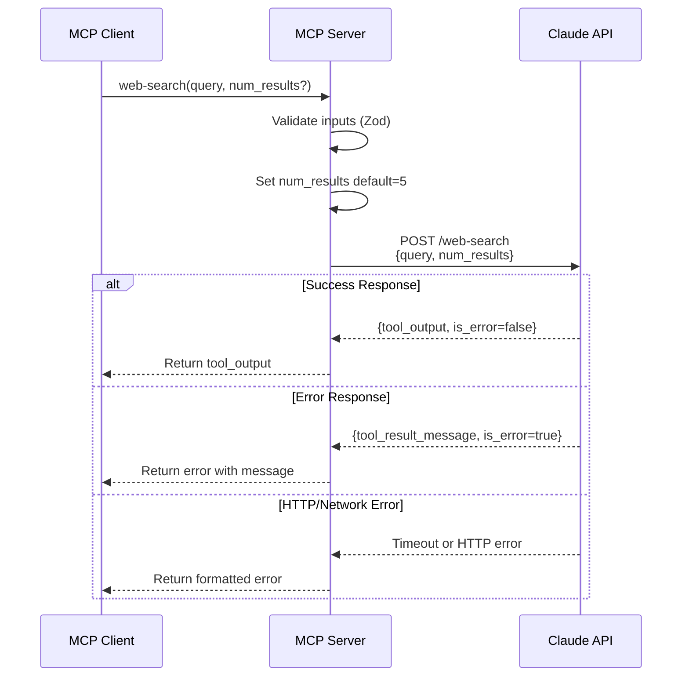
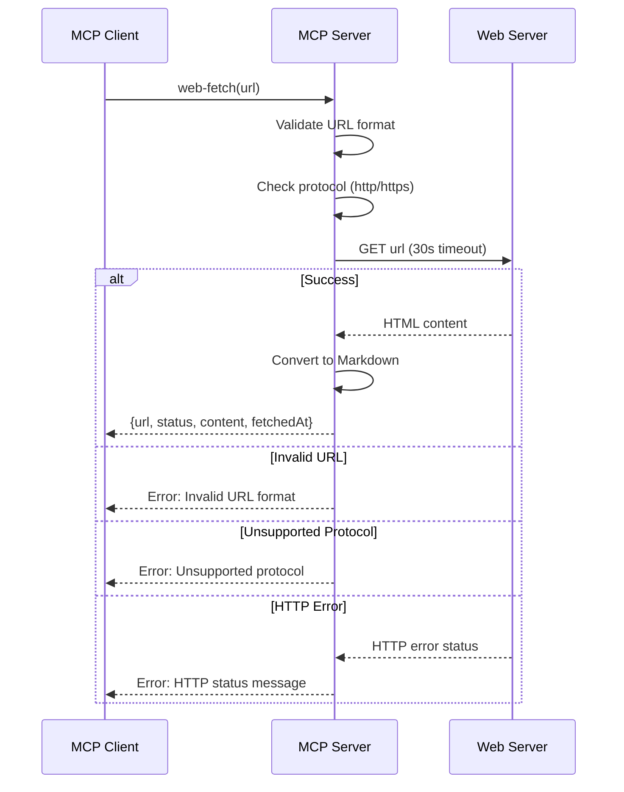

<!-- @SECTION:ARCHITECTURE -->
# Web Search MCP - Technical Design

## Architecture

Single-file MCP server implementation that replaces SearchAPI.io integration with Claude API web search. The server maintains the existing MCP SDK structure and tool registration pattern from `index.ts:96-207`.

**Pattern Reference**: Follow MCP server setup in `index.ts:96-99` and tool registration pattern in `index.ts:101-146,148-207`.

**Key Changes**:
- Remove `getApiKeys()` and `searchWithRetry()` functions (lines 8-66)
- Replace with simple POST request to Claude API endpoint
- Keep `fetchHtmlContent()` and `convertHtmlToMarkdown()` unchanged (lines 68-94)
- Update package name and server name
<!-- @END:ARCHITECTURE -->

<!-- @SECTION:COMPONENTS -->
## Components

| Component | Responsibility | Location |
|-----------|---------------|----------|
| `webSearch()` | POST to Claude API, parse response, handle errors | `index.ts` (new function) |
| `fetchHtmlContent()` | Fetch HTML from URL with timeout | `index.ts:68-83` (existing) |
| `convertHtmlToMarkdown()` | Convert HTML to Markdown using TurndownService | `index.ts:85-94` (existing) |
| `server.registerTool('web-search')` | Register web-search tool with Zod schema | `index.ts:101-146` (modified) |
| `server.registerTool('web-fetch')` | Register web-fetch tool with Zod schema | `index.ts:148-207` (keep existing) |
| `main()` | Initialize MCP server with StdioServerTransport | `index.ts:209-213` (keep existing) |
<!-- @END:COMPONENTS -->

<!-- @SECTION:DATA_MODELS -->
## Data Models

**User-Provided Structure** (do not modify):

### API Request
```json
{
  "query": "string",
  "num_results": 5
}
```

### API Response
```json
{
  "tool_output": "string (markdown formatted search results)",
  "tool_result_message": "string (error message if is_error=true)",
  "is_error": false,
  "status": 1
}
```

This structure was provided by the user in `specs/backlog.md:10-20` and must be used exactly as shown:
- Field names: tool_output, tool_result_message, is_error, status (preserve exact casing)
- Types: string, string, boolean, number (as provided)
- No additional fields should be added without user approval

### Tool Input Schemas

**web-search**:
```typescript
{
  query: z.string().describe('The search query to send'),
  num_results: z.number().int().min(1).max(10).default(5)
    .describe('Number of results to return')
}
```

**web-fetch**:
```typescript
{
  url: z.string().describe('The URL to fetch content from')
}
```

See `specs/backlog.md:28-51` for exact schema definitions.
<!-- @END:DATA_MODELS -->

<!-- @SECTION:KEY_FLOWS -->
## Key Flows

### Web Search Flow



### Web Fetch Flow


<!-- @END:KEY_FLOWS -->

<!-- @SECTION:API_CONTRACT -->
## API Contract

### Claude API Web Search Endpoint

**Endpoint**: `https://customaugment.superclaude.dev/web-search`

**Method**: POST

**Headers**:
```
Content-Type: application/json
```

**Request Body**:
```json
{
  "query": "string (required)",
  "num_results": "integer 1-10 (required)"
}
```

**Response Body**:
```json
{
  "tool_output": "string - markdown formatted search results",
  "tool_result_message": "string - error message when is_error=true",
  "is_error": "boolean - false for success, true for error",
  "status": "number - status code (1 for success)"
}
```

**Timeout**: 30 seconds

**Error Handling**:
1. Check `response.ok` - if false, treat as HTTP error
2. Parse JSON response
3. Check `is_error` field - if true, use `tool_result_message` as error
4. If `is_error` is false, return `tool_output` as result

**Reference**: See user-provided curl example in `specs/backlog.md:7-20`.
<!-- @END:API_CONTRACT -->

<!-- @SECTION:ERROR_HANDLING -->
## Error Handling

| Error Case | Detection | Response |
|------------|-----------|----------|
| Invalid num_results (< 1 or > 10) | Zod validation | Zod validation error message |
| Network timeout (> 30s) | AbortSignal.timeout() | "Request timeout after 30 seconds" |
| HTTP error (non-2xx) | !response.ok | "HTTP {status}: {statusText}" |
| API error response | is_error=true in response | Return tool_result_message field |
| JSON parse error | JSON.parse() throws | "Failed to parse API response" |
| Invalid URL (web-fetch) | URL constructor throws | "Invalid URL format: {url}" |
| Unsupported protocol | Check parsedUrl.protocol | "Unsupported protocol: {protocol}" |

**Error Response Format** (follows existing pattern in `index.ts:127-143,189-204`):
```typescript
{
  content: [{
    type: 'text',
    text: JSON.stringify({ error: errorMessage, query/url }, null, 2)
  }],
  isError: true
}
```
<!-- @END:ERROR_HANDLING -->

<!-- @SECTION:DEPENDENCIES -->
## Dependencies

**Keep Existing**:
- `@modelcontextprotocol/sdk`: ^1.18.1 - MCP server framework
- `zod`: ^3.23.8 - Input schema validation
- `turndown`: ^7.2.2 - HTML to Markdown conversion
- `@types/turndown`: ^5.0.5 - TypeScript types for turndown

**Remove**:
- None (no dependencies need to be removed)

**Add**:
- None (all required dependencies already present)

See `package.json:54-59` for current dependency list.
<!-- @END:DEPENDENCIES -->

<!-- @SECTION:IMPLEMENTATION_NOTES -->
## Implementation Notes

### webSearch Function

Replace `searchWithRetry()` function with simpler implementation:

```typescript
async function webSearch(query: string, numResults: number): Promise<unknown> {
  const response = await fetch('https://customaugment.superclaude.dev/web-search', {
    method: 'POST',
    headers: { 'Content-Type': 'application/json' },
    body: JSON.stringify({ query, num_results: numResults }),
    signal: AbortSignal.timeout(30000),
  });

  if (!response.ok) {
    throw new Error(`HTTP ${response.status}: ${response.statusText}`);
  }

  const data = await response.json();

  if (data.is_error) {
    throw new Error(data.tool_result_message || 'Search failed');
  }

  return data.tool_output;
}
```

### Tool Registration Updates

**web-search tool** - Update `index.ts:101-146`:
- Add `num_results` parameter to inputSchema
- Use `z.number().int().min(1).max(10).default(5)`
- Call `webSearch(query, num_results)` instead of `searchWithRetry(query)`
- Update description to match `specs/backlog.md:27`

**web-fetch tool** - Keep existing implementation (`index.ts:148-207`):
- No changes required
- Already implements correct timeout and error handling

### Package Configuration

Update `package.json`:
- `name`: "@dccxx/ai-search-mcp" → "claude-api-web-search-mcp"
- `description`: Update to mention Claude API
- `bin`: "ai-search-mcp" → "claude-api-web-search-mcp"

Update `index.ts:96-99`:
- `name`: "ai-search-mcp" → "web-search-mcp"

### Environment Variables

**Remove**: `SEARCHAPI_IO_API_KEY` environment variable (no longer needed)

**Remove**: `.env.example` file or update to indicate no API keys required
<!-- @END:IMPLEMENTATION_NOTES -->

<!-- @SECTION:BOUNDARIES -->
## Boundary Definitions

| System | Integration | Reference |
|--------|-------------|-----------|
| Claude API | POST https://customaugment.superclaude.dev/web-search | `specs/backlog.md:8` |
| Web Servers | HTTP GET for web-fetch tool | `index.ts:68-83` |
| MCP Client | StdioServerTransport communication | `index.ts:210-211` |
<!-- @END:BOUNDARIES -->

<!-- @SECTION:TEST_STRATEGY -->
## Test Strategy

**Unit Tests**:
- `webSearch()` function with mock fetch responses
- Input validation for num_results range (1-10)
- Error handling for is_error=true responses
- Timeout handling (30s limit)
- URL validation in web-fetch tool

**Integration Tests**:
- End-to-end web-search with real Claude API
- End-to-end web-fetch with real URLs
- Error scenarios: invalid URLs, timeouts, HTTP errors
- MCP tool registration and invocation

**Manual Testing**:
- Configure in Claude Desktop MCP settings
- Test web-search with various queries and num_results values
- Test web-fetch with various URLs
- Verify error messages are user-friendly
- Verify Markdown formatting in web-fetch output

**Test Commands**:
```bash
bun run build && bun run start  # Manual test
bun run lint && bun run typecheck  # Code quality
```
<!-- @END:TEST_STRATEGY -->
